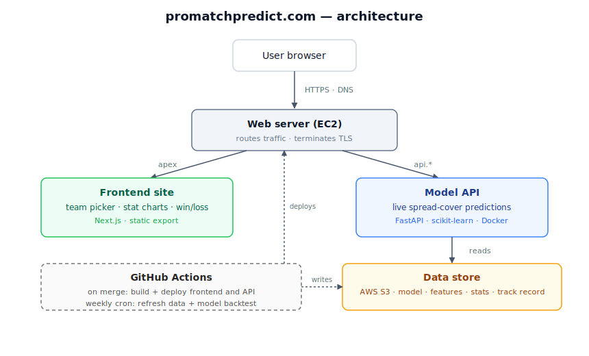

## Dagmawi's Portfolio

---

### Does Building Affordable Housing Raise Local Rents? A Bayesian Analysis

**Project overview:** Housing affordability has become a major political talking point, and the debate usually centers on market-rate housing. When affordable housing programs do come up, they tend to be criticized with little empirical evidence behind the claim. I wanted to measure the actual relationship between the Low-Income Housing Tax Credit (LIHTC), the largest affordable-housing program in the country, and local home values and rents.

After controlling for population growth and deflating prices with CPI-less-shelter, I find a modest positive association: 0.13% for home values and 0.32% for rents per 1% increase in LIHTC units per capita. The effect varies widely by state. It is strongest in high-demand states such as Hawaii, California, and Colorado, and is statistically indistinguishable from zero in states like Ohio and Oklahoma. That variation is the central result. It suggests the "national effect of LIHTC" is the wrong question, since housing policy plays out locally. A leave-one-out comparison favors the inflation-adjusted hierarchical model over the alternatives.

The data came from six public sources (HUD's LIHTC database of 54k+ projects, Zillow home and rent indices, three vintages of Census population estimates, and FRED inflation series), joined on county FIPS into two county-year panels. I fit a Bayesian hierarchical model in PyMC with county intercepts and state-level slopes, so each county is informed by its state rather than pooled into a single national average.

The positive sign is worth scrutiny. Added rental supply would normally push rents down, so the association more likely reflects where credits are allocated, toward markets with high housing demand, than a direct price effect of the units themselves.

<em>Each row is a state's posterior LIHTC slope on home values, 95% HDI. Several states sit on zero, others run well past it.</em>

***Technical skills:*** Bayesian Hierarchical Modeling, MCMC, Partial Pooling, LOO Model Comparison, Data Engineering (multi-source ETL)

***Tools:*** Python, PyMC, ArviZ, pandas, NumPy

[-blue?logo=adobeacrobatreader)](https://github.com/mawi510/lihtc-bayesian-analysis/blob/main/reports/LIHTC_Bayesian_Analysis_Report.pdf)

---

### NFL Betting Spread Prediction

__Try the model and explore team trends at <a href="https://promatchpredict.com/" target="_blank" rel="noopener noreferrer">promatchpredict.com</a>__

**Project overview:** As an avid sports fan, I looked for opportunities to incorporate both my fandom and my technical skillsets.

I scraped historical performance data, historical betting spreads, and historical weather to create a dataset to train a random forest classifier, which flows into the website listed above. This was a great project to construct an ETL pipeline, train/test an ML model, and then deploy said model to the cloud so others could interact with it.

The diagram below details how the website is powered and where data comes from

***Technical skills:*** ML model deployment, ETL, CI/CD, containerization, infrastructure as code, static site hosting

***Tools:*** Python, Sci-kit Learn, Docker, EC2, Github Actions

---
### Is The Powerball Rigged?

**Project overview:** I wanted to see if the powerball lottery was truly a fair lottery. If it wasn't, I would take advantage

The powerball lottery selects 5 random numbers between 1 and 69 without replacement. If the lottery was fair, the distribution of these numbers should match that of random distribution for numbers picked between 1 and 69 without replacement.

Unfortunately, the lottery is indeed a fair game, meaning I won't become a billionaire anytime soon. The QQ plot shows that the two distributions line up nearly perfectly, proving the powerball is indeed selecting the numbers at random, and there isn't any preference towards smaller or larger numbers.

***Technical skills:*** QQ Plot, Random Simulation

***Tools:*** Python, Statsmodels

---

Page template forked from <a href="https://github.com/evanca/quick-portfolio">evanca</a>

<!-- Remove above link if you don't want to attibute -->
